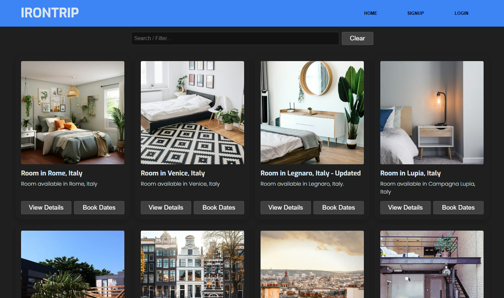

# IRONTRIP - A "Couchsurfing" free copy for Web Dev Ironhack Bootcamp

This is one of our projects in the [Ironhack](https://www.ironhack.com/fr-en/web-development/remote) journey.

## Table of contents

- [Overview](#overview)
  - [Screenshot](#screenshot)
  - [Context](#context)
  - [The challenge](#the-challenge)
  - [Deliverable Expected](#deliverable-expected)
  - [Links](#links)
- [Authors](#authors)
  - [Enrique CASTAÑEDA](#enrique-castañeda)
  - [Ronan CANNY](#ronan-canny)
- [React + Vite](#react-+-vite)
- [Expanding the ESLint configuration](#expanding-the-eslint-configuration)
- [Project Details](#project-details)
  - [User Stories](#user-stories)
  - [Backlog](#backlog)
  - [Client Routes](#routes)
  - [Pages](#pages)
  - [Components](#components)
  - [Services](#services)
  - [Models](#models)
  - [API Endpoints](#api-endpoints)

## Overview

### Screenshot



### Context

Ironhack has been training talent since 2013. With 7 campuses worldwide plus remote flexibility, more than 1,000 global hiring shares and over 12,500 student graduates; Ironhack trains in web development, web design, data analysis and cyber security. A single philosophy: “Learn by doing”. ironhack aims to have his learning experiences translated into real life experiences. [The aim of the web development bootcamp](https://www.ironhack.com/fr-en/web-development/paris) is to become a MERN Full-Stack developer (Mongo, Express, React, Node) via an intensive 3-module training program. 
- Module 1: Building Web development fundamentals and javascript mastery, validated by the creation of a game to run in the browser.
- Module 2: Improving your front-end skills with React integration, validated by the creation of an SPA capable of interacting with an external API.
Module 3: Building backend skills and advances full-stack development, validated by the development of a full web application as a final project using the MERN stack, simulating the real-life collaboration found in technology companies with the application of agile methodology and best practices.

### The challenge

The challenge is to build a Full-stack application using the MERN stack (MongoDB, Express, React and Node.JS). Here is the frontend build with a minimal setup to get React working in Vite with HMR and some ESLint rules.

### Deliverable Expected

The full-stack application must meet the following technical requirements:

- Have a SPA frontend, built with React, consisting of multiple views and implementing all CRUD actions.
- Have a REST API backend built with ExpressJS, MongoDB and Mongoose, that your React app will communicate with.
- Have a REST API backend with routes that perform all CRUD actions for at least one model (excluding the user model).
- Have 3 database models or more. Having one model for users is the first step. The other two (or more) models should represent the main functionality of your app.
- Include sign-up, log-in and log-out functionality with encrypted passwords (or social login) and authorization (logged-in users can do additional things).
- Have two separate repos on GitHub. One repo is for your frontend React application and the other is for your backend REST API.
- Have at least 2 commits per day that you worked on.
- Have a backend validation and centralized error handling in your REST API.
- Be deployed online, allowing anyone to access and use your app.
- As a final step, check all the features outlined in points 1 - 5 and ensure they are implemented and working ahead of delivery.

### Links

- Frontend Repository URL: [Click here](https://github.com/CannyRo/irontrip-frontend)
- Frontend Live URL: [Click here](https://irontrip-frontend.netlify.app/)

- Backend Repository URL: [Click here](https://github.com/ecastanedam/irontrip-backend)

- Slides Presentation URL: [Click here]()

## Authors

### Enrique CASTAÑEDA

- GitHub - [@ecastanedam](https://github.com/ecastanedam/)

### Ronan CANNY

- GitHub - [@CannyRo](https://github.com/CannyRo)

## React + Vite

This template provides a minimal setup to get React working in Vite with HMR and some ESLint rules.

Currently, two official plugins are available:

- [@vitejs/plugin-react](https://github.com/vitejs/vite-plugin-react/blob/main/packages/plugin-react/README.md) uses [Babel](https://babeljs.io/) for Fast Refresh
- [@vitejs/plugin-react-swc](https://github.com/vitejs/vite-plugin-react-swc) uses [SWC](https://swc.rs/) for Fast Refresh

## Expanding the ESLint configuration

If you are developing a production application, we recommend using TypeScript and enable type-aware lint rules. Check out the [TS template](https://github.com/vitejs/vite/tree/main/packages/create-vite/template-react-ts) to integrate TypeScript and [`typescript-eslint`](https://typescript-eslint.io) in your project.

## Project Details

### User Stories

-  **404:** As an anon/user I can see a 404 page if I try to reach a page that does not exist so that I know it's my fault
-  **Signup:** As an anon I can sign up in the platform so that I can start saving favorite restaurants
-  **Login:** As a user I can login to the platform so that I can see my favorite restaurants
-  **Logout:** As a user I can logout from the platform so no one else can use it
-  **Add a Listing** As a user I can add a listing so that I can share it with the community
-  **List of Listings** As a user (host) I want to see the listings so that I can choose one to book it
-  **Filter Listings** As a user I want to filter listings by searching any type of word in the title, the location or the description of a listing
-  **Update a Listing** As a user (host) I want to update informations of a Listing
-  **Delete a Listing** As a user (host) I want to delete a Listing
-  **Add a Request** As a user (traveler) I want to add a request - it means to book a Listing
-  **Update a Request** As a user I want to update a request (date, message - as a traveler OR status - as a host)
-  **Delete a Request** As a user (traveler) I want to delete a request
-  **Update a profile** As a user I want to update my bio in my profile

### Client Routes
- / - Homepage - Home page with Listing list
- /auth/signup - Signup page with Signup form
- /auth/login - Login page with Login form
- /profile - My proofile
- /listings - My Listing page with Listing list 
- /listing/:id - A Listing detail page
- /create-listing - Create a listing
- /edit-listing/:id - Edit a listing
- /requests - My request page with Request list 
- /listings/:id/request - Create a Request for this Listing
- /edit-request/:id - Edit a Request
- /about
- 404

### Pages

- Home Page (public)
- Sign in Page (anon only)
- Log in Page (anon only)
- Listing Page (user only)
- Listing Create (user only)
- Listing Detail page (public)
- Listing Edit page (user only)
- Request Page (user only)
- Request Create (user only)
- Request Detail page (public)
- Request Edit page (user only)
- My Profile Page (user only)
- 404 Page (public)

### Components
- Header
    - Navabr
      - Logout button
- Signup form
- Login form
- SearchBar
- Listing List
- Listing form
- Map
- Request List
- Request form
- Footer

### Services

- Auth Service
- Listing Service
- Request Service
- User Service

### Models

User model
```
username - String // unique & required
email - String // unique & required
password - String // required
city - String // required
country - String // required
offerspace - Boolean
bio - String
profilePicture - String
```
Listing model

```
host - ObjectID<User> // required
title - String // required
address - String // required
city - String // required
country - String // required
location - { lat: String,  lng: String }
description - String // required
availibility - { 
    startDate : Date // required
    endDate : Date // required
}
image - String
```
Request model

```
listing - ObjectID<Listing> // required
host - ObjectID<User> // required
traveler - ObjectID<User> // required
arrivalDate - Date // required
departureDate - Date // required
messageToHost - String // required
status - String
```

### API Endpoints

- GET /auth/verify
- POST /auth/signup
- POST /auth/login

- GET /user/:userId
- PATCH /user/update/:userId

- GET /listing
- GET /listing/host/:userId
- GET /listing/:listingId
- POST /listing/create
- PATCH /listing/update/:listingId
- DELETE /listing/:listingId

- GET /request
- GET /request/user/:userId
- POST /request/create
- PATCH /request/update/:requestId
- DELETE /request/delete/:requestId
